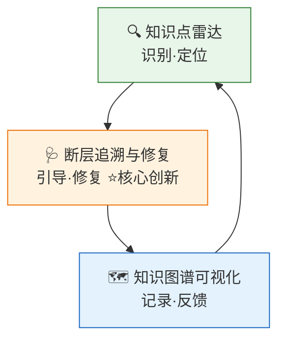
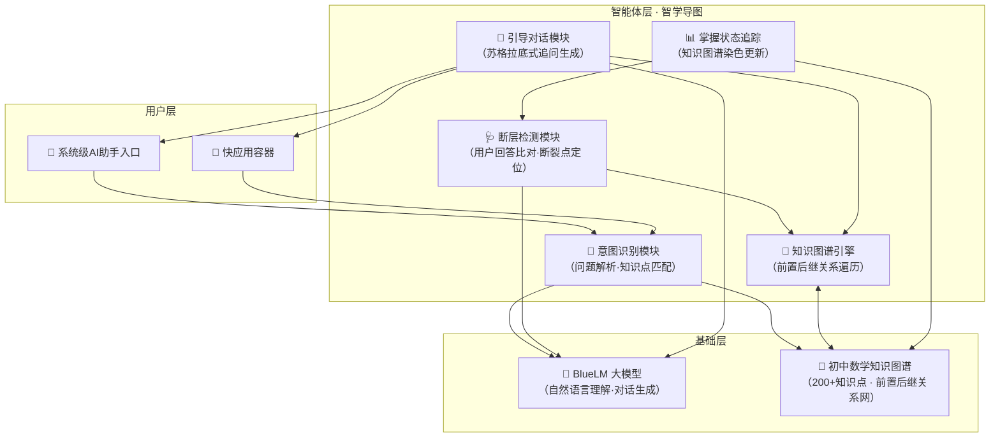

# 智学导图 —— 参赛作品展示PPT大纲

> **赛事**：AIGC高校竞赛（初赛）
> **作品形态**：AI智能体 + 快应用
> **目标学科**：初中数学
> **页数规划**：13页，分5大部分

---

## 整体结构

| 部分 | 页码 | 核心目标 |
| :--- | :--- | :--- |
| **一、项目概述** | 1-3 | 建立第一印象，说清"我们做什么" |
| **二、需求分析** | 4-5 | 用数据和研究证明"为什么值得做" |
| **三、产品方案** | 6-10 | 展示"我们怎么做"，突出差异化 |
| **四、技术实现** | 11-12 | 证明"我们能做出来" |
| **五、总结展望** | 13 | 收束价值，留下记忆点 |

---

## 一、项目概述（第1-3页）

### 第1页 · 封面

```
                    2026 AIGC高校竞赛

                    智  学  导  图

            初中数学 · AI引导式学习助手

        —————————————————————————————
```

**底部信息**：参赛团队：[团队名称] ｜ 指导老师：[姓名] ｜ 2026.05

---

### 第2页 · 目录

| 序号 | 部分 | 内容概要 |
| :--- | :--- | :--- |
| 01 | 项目概述 | 背景、定位、核心理念 |
| 02 | 需求分析 | 研究数据支撑、目标用户画像 |
| 03 | 产品方案 | 作品形态、三大核心功能 |
| 04 | 技术实现 | 典型交互案例、技术架构 |
| 05 | 总结展望 | 项目价值、未来规划 |

---

### 第3页 · 项目简介

**作品名称**：**智学导图**

**作品类型**：AI智能体 + 快应用

**目标学科**：初中数学（初一至初三）

**核心理念**：**引导而非告知，修复而非跳过**

**一句话定位**：

> 做初中生数学学习的**"导航员"**与**"断层修复师"**——不只告诉学生答案是什么，而是帮他找到"从哪里开始不会了"，然后带着他一步步自己推出来。

**创意来源**：

团队中有成员长期从事家教辅导，观察到一个反复出现的现象：学生面对难题时，真正的问题往往不在题目本身，而在于某个更基础的知识点没有被真正掌握。直接讲解这道题收效甚微——但一旦找到那个"断裂点"，从那里开始补，学生不仅能做出这道题，连后面相关联的一串题都能迎刃而解。**智学导图**的灵感正是由此而来：让AI扮演那个有经验的家教老师，用同样的"溯源引导法"帮助每一个学生。

---

## 二、需求分析（第4-5页）

### 第4页 · 问题洞察——为什么当前的AI学习工具不够好？

#### 核心论据：AI不是用得越多学得越好

**宾夕法尼亚大学大型实地实验（发表于 PNAS, 2025）** 对近千名高中生进行对照研究：

| 学习方式 | 练习阶段进步 | 最终考试成绩（撤掉AI后） |
| :--- | :--- | :--- |
| 自由使用ChatGPT（直接要答案） | +48% | **下降 17%** |
| GPT Tutor（仅给提示，不给答案） | +127% | 与不用AI组持平 |
| 不用AI（对照组） | 基准水平 | 基准水平 |

> **结论**：无约束地使用AI是"拐杖"——作业看起来变好了，但真正学会的反而更少。

#### 当前AI学习工具的三大痛点

| 痛点          | 具体表现                             | 数据佐证                                                                                         |
| :---------- | :------------------------------- | :------------------------------------------------------------------------------------------- |
| **01 答案导向** | AI直接输出解题步骤，学生复制粘贴了事              | 英国高等教育政策研究所（2025）：92%本科生用AI做作业，18%承认直接复制答案                                                   |
| **02 断层隐蔽** | 前置知识未掌握导致后续必然卡住，但工具无法识别"从哪里开始不会" | 《British Journal of Educational Technology》（2024）：基于2798名学生的研究表明，分数理解显著预测百分比理解——前置知识断裂具有传导效应 |
| **03 缺乏引导** | 没有从易到难的教学路径，学生遇难则退               | 中国青少年研究中心（2025）：20.5%的中小学生"想依赖AI思考，不想自己思考"                                                   |

> **核心判断**：多数AI学习工具在帮学生**绕过问题**，而非**解决问题**。智学导图要做的恰恰相反。

---

### 第5页 · 目标用户

#### 用户画像

**核心用户**：初中学生（初一至初三），尤其是数学基础存在断层的学习者

**典型特征**：

- 课堂听懂但做题困难——知识点没有被真正内化
- 遇到难题习惯性跳过或直接搜答案——缺乏引导式学习体验
- 不会的知识点不知道自己"不会"——前置知识断裂但无工具诊断

#### 三个典型使用场景

| 场景 | 用户状态 | 智学导图的介入方式 |
| :--- | :--- | :--- |
| **课后作业遇到难题** | 卡住、焦虑、想搜答案 | 识别知识点 → 追问前置 → 找到断裂点 → 引导推导 |
| **考前复习查漏补缺** | 不确定哪些知识有漏洞 | 知识图谱可视化 → 标注掌握状态 → 定位薄弱环节 |
| **预习新知识** | 不知道需要哪些前置基础 | 展示知识前置链 → 确认前置掌握 → 开始学习新内容 |

---

## 三、产品方案（第6-10页）

### 第6页 · 产品形态

#### 作品基本信息

| 维度 | 说明 |
| :--- | :--- |
| **作品名称** | **智学导图** |
| **作品形态** | AI智能体 + 快应用 |
| **承载平台** | 手机系统级AI助手 + 快应用容器 |
| **技术底座** | BlueLM大模型 + 初中数学知识图谱 |
| **目标学科** | 初中数学（初一至初三） |
| **知识覆盖** | 200+核心知识点（规划覆盖） |

#### 形态优势

- **无需下载安装**：快应用即点即用，零安装门槛
- **符合中学生使用习惯**：手机是中学生最常用的设备，系统级AI入口降低使用门槛
- **AI智能体承载核心逻辑**：意图识别、断层检测、引导对话由智能体统一调度

---

### 第7页 · 核心功能一 — 知识点雷达

#### 定位：精准识别问题背后的知识结构

用户输入数学问题后，AI**不直接输出答案**，而是先做三件事：

1. 识别本题考察的核心知识点
2. 列出完成本题所需的完整前置知识链
3. 询问用户是否已掌握各前置知识点

#### 交互流程示意

```
用户提问："解方程 2(x+3) = 14"

    ↓

AI识别：
  核心知识点 → 一元一次方程解法
  前置知识链 →
    ① 等式的性质（小学）
    ② 乘法分配律（初一上）
    ③ 移项与合并同类项（初一上）

    ↓

AI询问："在解这道题之前，我们先确认一下——
  乘法分配律你还记得吗？比如 2×(a+b) 应该怎么展开？"
```

#### 创意亮点

区别于传统AI工具直接给出解答，知识点雷达**将一次提问转化为一次知识结构的诊断机会**——让学生第一次看到自己所学知识之间的前后关系。

---

### 第8页 · 核心功能二 — 断层追溯与修复  ⭐核心创新

#### 定位：像经验丰富的家教老师一样，找到"从哪里开始不会"

这是智学导图**最核心的差异化功能**。灵感来自团队成员的家教实践——面对一个"不会做某道题"的学生，有经验的老师不会直接讲这道题，而是**沿着知识链向下追溯**，直到找到那个真正的断裂点。

#### 四步工作流

| 步骤 | 动作 | 说明 |
| :--- | :--- | :--- |
| **Step 1 · 断层检测** | 沿知识链向下追问 | 从当前知识点出发，逐一追问前置知识点相关问题，判断掌握程度 |
| **Step 2 · 定位断裂点** | 找到"从哪开始不会" | 当用户连续正确回答时继续向下，首次出现模糊或错误的位置即为断裂点 |
| **Step 3 · 渐进引导** | 从断裂点逐级向上讲解 | 不跳跃，确保每一级知识被理解后再进入下一级 |
| **Step 4 · 自主推导** | 让学生自己得出答案 | 借助苏格拉底式追问，引导用户运用已修复的知识链独立推导出原题答案 |

#### 核心原则（体现引导式学习理念）

- ❌ **不直接给答案**：即使学生反复要求，AI也以提示和子问题引导
- ❌ **不跳过任何一级知识**：确保知识链完整修复，而非临时记忆
- ✅ **让学生自己说出答案**：自主推导的过程才是真正的学习
- ✅ **每次对话都是一次系统性修复**：不是"帮你搞定这道题"，而是"帮你搞定这类题"

#### 与现有工具的对比

| 对比维度 | 传统AI学习工具 | 智学导图 |
| :--- | :--- | :--- |
| 学生提问后的响应 | 直接输出解题步骤 / 答案 | 追溯知识断裂点 |
| 对前置知识的处理 | 假定学生已掌握 | 主动检测并修复 |
| 教学理念 | 告知式（告诉你怎么做） | 引导式（带你找到怎么做） |
| 学习深度 | 表面理解，容易遗忘 | 修复断层，建立迁移能力 |

---

### 第9页 · 核心功能三 — 知识图谱可视化

#### 定位：让学生看见自己的"数学知识大厦"

以**知识树**的形式展示初中数学200+核心知识点的层级结构，每个知识点标注学生的掌握状态（已掌握 / 薄弱 / 未学习）。

#### 覆盖范围（初中数学六个学期）

| 年级 | 核心知识模块 |
| :--- | :--- |
| **初一上** | 有理数、整式的加减、一元一次方程 |
| **初一下** | 相交线与平行线、实数、二元一次方程组、不等式 |
| **初二上** | 三角形、全等三角形、轴对称、整式乘法与因式分解、分式 |
| **初二下** | 二次根式、勾股定理、一次函数、平行四边形、数据的分析 |
| **初三上** | 一元二次方程、二次函数、旋转、圆、概率初步 |
| **初三下** | 相似三角形、锐角三角函数、投影与视图 |

#### 掌握状态的三色标注

- 🟢 **绿色**：已掌握——通过断层检测验证无误
- 🟡 **黄色**：薄弱——在引导下可以完成，但不够熟练
- ⚪ **灰色**：未学习——尚未接触该知识点

#### 用户价值

- **看见全局**：清晰知道自己处于"数学大厦的哪一层"
- **看见差距**：薄弱环节一目了然，避免盲目刷题
- **看见进步**：随着学习推进，灰色和黄色节点逐渐变绿，形成正向反馈

---

### 第10页 · 功能总结 —— 学习闭环

#### 三大功能协同关系



#### 核心设计理念

> **每一次提问，都是一次系统性修复的机会。**
>
> 智学导图不做"答案机器"，而是一个**学习闭环引擎**：
> - **雷达**定位问题在知识体系中的位置
> - **断层修复**从根源解决问题，而非表面应付
> - **图谱**记录每一次修复，让进步可见、可追踪
>
> 三轮循环下来，学生不仅解决了当前这道题，更重建了支撑这道题的整个知识地基。

---

## 四、技术实现（第11-12页）

### 第11页 · 典型交互案例

#### 场景：初三学生遇到二次函数配方法求顶点坐标

> *说明：以下案例为团队基于家教经验预想的典型引导场景，展示了智学导图"不直接给答案、逐级引导推导"的核心理念。*

**背景**：初三学生小华在求解"y = 2x² - 8x + 5的顶点坐标"时卡住。他声称"学过配方法但忘了怎么做"。如果是传统AI工具，会直接输出完整的配方法解题步骤——小华看完以为自己懂了，但下一道稍有变化的题仍然不会。

智学导图的处理方式如下：

| 轮次 | 角色 | 内容 | 教学意图 |
| :--- | :--- | :--- | :--- |
| — | 用户 | 求顶点坐标：y = 2x² - 8x + 5，我不会做 | 提出问题 |
| 1 | AI | 先不急着做这道题。配方法的第一步是处理二次项系数。2x² - 8x，把公因数2提出来，括号里剩下什么？ | 检测"提取公因数"这一前置操作 |
| 1 | 用户 | 2(x² - 4x) + 5 | ✅ 前置知识一：通过 |
| 2 | AI | 正确！现在看括号里的 x² - 4x，要把它配成完全平方，需要加上一个什么数？提示：一次项系数是 -4 | 检测"配完全平方"这一前置操作 |
| 2 | 用户 | 嗯……加4？ | ✅ 略作思考后正确，前置知识二：通过 |
| 3 | AI | 没错，x² - 4x + 4 = (x-2)²。但我们在括号里加了4，外面要相应减去多少？别忘了前面还有个系数2 | 检测"配方法的恒等变形" |
| 3 | 用户 | 减8？因为2×4=8 | ✅ 推理正确，前置知识三：通过 |
| 4 | AI | 很好。整理一下：2[(x-2)² - 4] + 5 = 2(x-2)² - 8 + 5。继续化简，顶点坐标是？ | 至此所有前置知识已确认，引导完成 |
| 4 | 用户 | 2(x-2)² - 3，顶点是(2, -3)！我自己推出来了！ | 用户独立完成最终答案 |
| 5 | AI | 完全正确，而且完全是你自己推出来的。回顾一下，你刚才用到了配方法的三个关键步骤：提取公因数 → 配完全平方 → 恒等变形整理。下次遇到类似题目，你完全可以独立完成了 👍 | 知识链修复完成，给予正向反馈 |

#### 案例结论

在这个引导过程中，小华实际经历了完整的配方法推导过程，每一个步骤都是在他自己的思考和回答中推进的。AI的角色是**提问者**和**确认者**，而非**告知者**。这种"苏格拉底式引导"正是智学导图与所有传统AI学习工具的根本区别。

> **来自团队家教经验的判断**：这样的引导方式，一节课的效果往往超过学生自己刷二十道题——因为他真正理解了"为什么这么做"，而不仅仅是"怎么做"。

---

### 第12页 · 技术架构与可行性

#### 系统架构图



#### 技术方案详解

| 模块 | 技术方案 | 关键说明 |
| :--- | :--- | :--- |
| **意图识别** | BlueLM大模型 + 定制Prompt | 解析用户输入的自然语言问题，匹配知识图谱中对应知识点及其前置链 |
| **知识图谱** | 预定义知识关系网络 | 覆盖初中数学六个学期200+核心知识点（初赛阶段为规划设计），每个节点包含"前置知识"与"后继知识"的双向关系 |
| **断层检测** | 图谱遍历 + 用户回答语义比对 | 沿知识链向下逐级追问，通过BlueLM判断用户回答的正确性和熟练程度，定位断裂点 |
| **引导对话** | BlueLM + 苏格拉底式Prompt约束 | 严格控制AI行为：①不得直接输出完整解题步骤 ②每次只给一个子问题 ③必须等待用户回答后再进入下一步 ④用户连续正确回答时进入正向激励 |
| **前端形态** | 快应用 + 系统AI助手API | 用户通过手机系统级AI入口或快应用发起提问，智能体处理后以对话流形式返回引导内容 |

#### 可行性论述

**本方案的核心竞争力在于：不依赖AI的"原创生成能力"，而是依赖"预定义知识结构 + 大模型理解能力"的组合。**

| 维度 | 分析 |
| :--- | :--- |
| **确定性** | 知识图谱和前置后继关系由数学学科专家预定义，准确可靠，不依赖大模型的"凭空生成" |
| **可控性** | 引导对话通过Prompt约束确保AI行为可控——不直接给答案、不跳过步骤，符合教育场景的严格要求 |
| **可落地性** | 意图识别、对话生成、图谱遍历——这些均为大模型和传统算法的成熟能力，无技术不确定性 |
| **创新性** | 创新不在底层技术本身，而在"知识图谱 + 大模型引导对话"的**融合范式**——这是当前AI教育领域的前沿探索方向 |

---

## 五、总结展望（第13页）

### 第13页 · 项目价值与未来规划

#### 项目价值

| 维度 | 价值阐述 |
| :--- | :--- |
| **对学生** | 不做"答案搬运工"，而是建立真正的数学知识体系。每一次提问都修复一个知识断层，让学习不只是"会做这道题"，而是"会做这类题" |
| **对教育** | 推动AI学习工具从"告知式"向"引导式"转型。将苏格拉底式教学法数字化、规模化，让每个学生都能获得经验家教的引导式辅导 |
| **对技术** | 验证"知识图谱 + 大模型引导对话"融合范式在垂直教育领域的可行性，为AI教育产品中"AI负责理解与对话、知识谱图负责结构化认知"的分工提供实践案例 |

#### 未来规划

| 阶段 | 时间 | 目标 |
| :--- | :--- | :--- |
| **短期** | 6个月 | 完成初中数学知识图谱建设与引导对话模型调优，实现核心功能的可用版本 |
| **中期** | 1年 | 扩展至初中物理、化学等理科；接入更多快应用和智能体平台 |
| **长期** | 2-3年 | 构建K-12全学段知识图谱，与学校教学系统对接，提供班级与个体层面的学情分析报告，成为AI时代的学习导航基础设施 |

#### 结束语

> **智学导图 —— 用AI修复知识的地基，让每一个"不会"都变成"学会了"。**

**底部**：感谢聆听 ｜ 欢迎指正 ｜ [团队名称]

---

> **附录说明**：
> - 第7-9页的三大核心功能页面可各配套一张产品示意图（如有原型/设计稿）
> - 第12页的Mermaid架构图可直接使用 [Mermaid Live Editor](https://mermaid.live) 渲染为PNG嵌入PPT
> - 第4页的研究数据引用建议在PPT中以脚注形式标注来源，增强学术可信度
