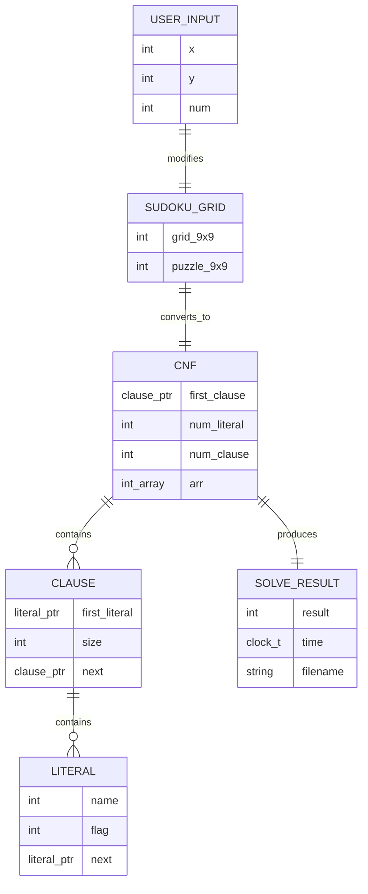
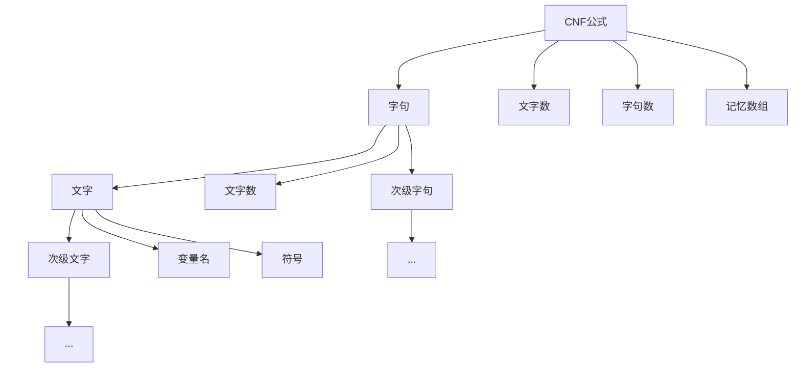

# SAT求解器与数独系统数据结构分析

## 系统数据类型概述

本系统主要处理三类核心数据：**CNF公式数据**、**数独游戏数据**和**求解结果数据**。这些数据类型支撑了SAT求解和数独游戏的完整功能。

## 数据类型详细分析

### 1. CNF公式数据类型

**文字(Literal)结构**
- 表示CNF公式中的基本逻辑单元，包含变量名和符号信息
- 采用链表结构组织，支持动态扩展

**子句(Clause)结构**  
- 表示由多个文字组成的析取式
- 包含文字链表和子句大小信息

**CNF公式(CNF)结构**
- 表示完整的合取范式，包含所有子句
- 维护全局统计信息和求解状态数组

### 2. 数独游戏数据类型

**数独网格数据**
- 使用二维整型数组表示9×9数独棋盘
- 0表示空格，1-9表示填入的数字

**游戏状态数据**
- 包括当前游戏网格、原始提示网格
- 用户输入坐标和数字信息

### 3. 求解结果数据类型

**求解状态数据**
- 布尔型结果表示求解成功或失败
- 整型数组存储变量赋值结果

**性能统计数据**
- 时间戳记录求解耗时
- 文件路径信息用于结果保存

## 数据结构汇总表

| 数据类型 | 数据项 | 数据类型 | 说明 |
|---------|--------|----------|------|
| **literal** | name | int | 变量名(1-729) |
| | flag | int | 符号(1为正，-1为负) |
| | next | literal* | 指向下一个文字的指针 |
| **clause** | first_literal | literal* | 指向首个文字的指针 |
| | size | int | 子句中文字数量 |
| | next | clause* | 指向下一个子句的指针 |
| **cnf** | first_clause | clause* | 指向首个子句的指针 |
| | num_literal | int | 总变量数量 |
| | num_clause | int | 总子句数量 |
| | arr | int* | 变量赋值数组 |
| **数独网格** | grid | int[9][9] | 数独棋盘状态 |
| | puzzle | int[9][9] | 原始提示数字 |
| **用户输入** | x, y | int | 坐标位置(1-9) |
| | num | int | 填入数字(1-9) |
| **求解结果** | result | int | 求解状态(0失败，1成功) |
| | time | clock_t | 求解耗时 |
| | filename | char[] | 结果文件路径 |

## 数据关系图

### 数据结构关系

### 数据流转关系

