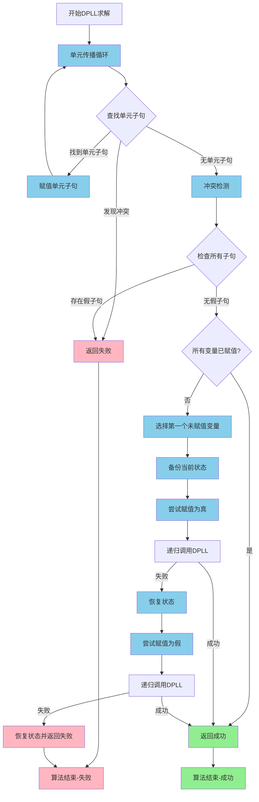
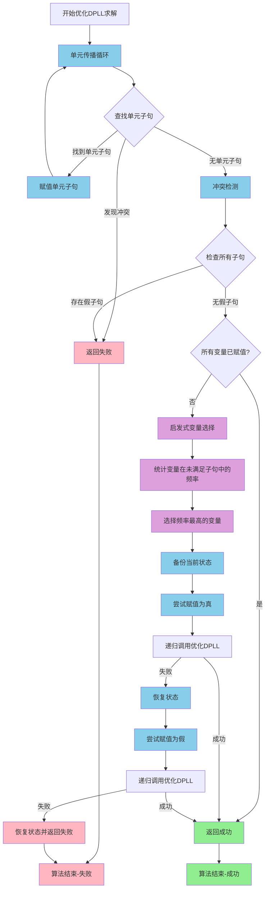

# SAT求解器完整Mermaid流程图

请生成以下两个完整的Mermaid流程图：

## 基础DPLL算法流程图

```mermaid
flowchart TD
    A[开始DPLL求解] --> B[单元传播循环]
    B --> C{查找单元子句}
    C -->|找到单元子句| D[赋值单元子句]
    C -->|发现冲突| E[返回失败]
    C -->|无单元子句| F[冲突检测]
    D --> B
    
    F --> G{检查所有子句}
    G -->|存在假子句| E
    G -->|无假子句| H{所有变量已赋值?}
    
    H -->|是| I[返回成功]
    H -->|否| J[选择第一个未赋值变量]
    
    J --> K[备份当前状态]
    K --> L[尝试赋值为真]
    L --> M[递归调用DPLL]
    M -->|成功| I
    M -->|失败| N[恢复状态]
    N --> O[尝试赋值为假]
    O --> P[递归调用DPLL]
    P -->|成功| I
    P -->|失败| Q[恢复状态并返回失败]
    
    E --> R[算法结束-失败]
    I --> S[算法结束-成功]
    Q --> R
    
    classDef success fill:#90EE90
    classDef failure fill:#FFB6C1
    classDef process fill:#87CEEB
    
    class I,S success
    class E,R,Q failure
    class B,D,F,J,K,L,N,O process
```

## 优化DPLL算法流程图

```mermaid
flowchart TD
    A[开始优化DPLL求解] --> B[单元传播循环]
    B --> C{查找单元子句}
    C -->|找到单元子句| D[赋值单元子句]
    C -->|发现冲突| E[返回失败]
    C -->|无单元子句| F[冲突检测]
    D --> B
    
    F --> G{检查所有子句}
    G -->|存在假子句| E
    G -->|无假子句| H{所有变量已赋值?}
    
    H -->|是| I[返回成功]
    H -->|否| J[启发式变量选择]
    
    J --> J1[统计变量在未满足子句中的频率]
    J1 --> J2[选择频率最高的变量]
    J2 --> K[备份当前状态]
    
    K --> L[尝试赋值为真]
    L --> M[递归调用优化DPLL]
    M -->|成功| I
    M -->|失败| N[恢复状态]
    N --> O[尝试赋值为假]
    O --> P[递归调用优化DPLL]
    P -->|成功| I
    P -->|失败| Q[恢复状态并返回失败]
    
    E --> R[算法结束-失败]
    I --> S[算法结束-成功]
    Q --> R
    
    classDef success fill:#90EE90
    classDef failure fill:#FFB6C1
    classDef process fill:#87CEEB
    classDef heuristic fill:#DDA0DD
    
    class I,S success
    class E,R,Q failure
    class B,D,F,K,L,N,O process
    class J,J1,J2 heuristic
```

## 关键差异说明
- **基础版本**：直接选择第一个未赋值变量进行分支
- **优化版本**：使用启发式策略，选择在未满足子句中出现频率最高的变量，提高求解效率