# 3.2 系统模块实现流程详述

## 1. Display模块实现流程

### 1.1 算法思想
Display模块采用分层菜单设计，通过状态机模式管理用户交互流程，实现清晰的用户界面逻辑。该模块作为整个系统的前端控制器，负责用户交互、文件管理和结果展示。

### 1.2 核心代码实现

#### 主菜单显示函数
```c
void print_menu(void)
{
    printf("\n=== Main Menu ===\n");
    printf("1. CNF file solving\n");
    printf("2. Percent Sudoku game\n");
    printf("3. Exit\n");
    printf("Enter your choice: ");
}
```

#### CNF求解子菜单
```c
void print_sec_menu(void)
{
    printf("\n=== CNF Solver Menu ===\n");
    printf("1. Use DPLL strategy\n");
    printf("2. Use Q-DPLL strategy and display the optimization rate\n");
    printf("3. Init-display\n");
    printf("4. Back to Main Menu\n");
    printf("Enter your choice: ");
}
```

#### 文件选择核心实现
```c
int select_cnf_file(char *selected_filename)
{
    DIR *dir;
    struct dirent *entry;
    struct stat file_stat;
    char file_list[100][256];
    int file_count = 0;

    dir = opendir("input");
    if (dir == NULL)
    {
        printf("Cannot open input directory!\n");
        return 0;
    }

    printf("\nAvailable CNF files in input folder:\n");
    printf("No.  Filename                    Size(bytes)\n");
    printf("---  ------------------------  -----------\n");

    while ((entry = readdir(dir)) != NULL)
    {
        if (strstr(entry->d_name, ".cnf") != NULL)
        {
            char full_path[300];
            sprintf(full_path, "input/%s", entry->d_name);

            if (stat(full_path, &file_stat) == 0)
            {
                printf("%-3d  %-24s  %11ld\n",
                       file_count + 1, entry->d_name, file_stat.st_size);
                strcpy(file_list[file_count], full_path);
                file_count++;
            }
        }
    }
    closedir(dir);

    if (file_count == 0)
    {
        printf("No CNF files found in input folder!\n");
        return 0;
    }

    int choice;
    printf("\nEnter file number (1-%d): ", file_count);
    scanf("%d", &choice);

    if (choice < 1 || choice > file_count)
    {
        printf("Invalid choice!\n");
        return 0;
    }

    strcpy(selected_filename, file_list[choice - 1]);
    return 1;
}
```

#### 结果显示和优化率计算
```c
void print_result(int result, clock_t time, cnf *p_cnf)
{
    printf("The CNF file has %d literals and %d clauses.\n", p_cnf->num_literal, p_cnf->num_clause);
    printf("Result: %s\n", result ? "SAT" : "UNSAT");
    if (time == 0)
    {
        printf("Time taken: < 1 ms\n");
    }
    else
    {
        printf("Time taken: %ld ms\n", time);
    }
}

void print_improve(clock_t whole_time, clock_t q_whole_time, int result)
{
    if (result == 1)
    {
        if (whole_time == 0 && q_whole_time == 0)
        {
            printf("The optimization rate: Both algorithms completed in < 1 ms\n");
        }
        else if (whole_time == 0)
        {
            printf("The optimization rate: DPLL < 1 ms, Q-DPLL %ld ms\n", q_whole_time);
        }
        else
        {
            double rate = (1 - (double)q_whole_time / whole_time) * 100;
            printf("The optimization rate is: %.2f%%\n", rate);
        }
    }
}
```

### 1.3 主要流程

#### 主程序控制流程
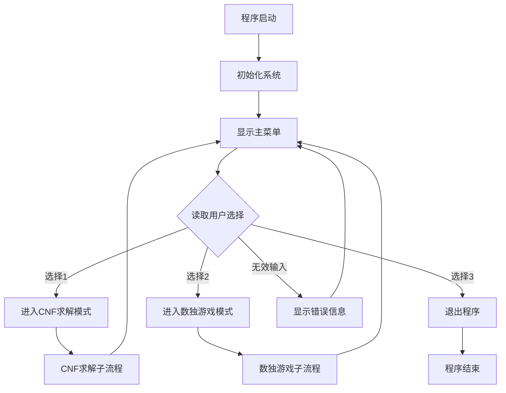

#### CNF求解交互流程
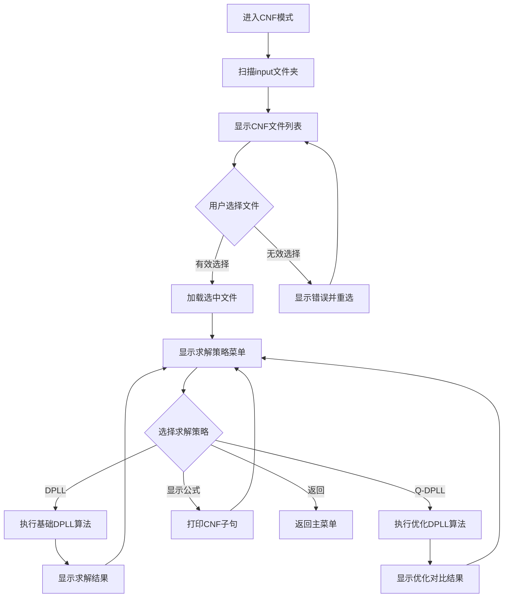

### 1.4 核心实现逻辑

**文件选择机制：**
- 使用`opendir()`和`readdir()`遍历input目录
- 过滤.cnf扩展名文件
- 获取文件大小信息并格式化显示
- 提供编号选择界面

**结果展示策略：**
- 统一的结果输出格式（SAT/UNSAT状态）
- 时间测量精确到毫秒级
- 优化率计算公式：`(1 - Q-DPLL时间/DPLL时间) × 100%`

---

## 2. CNFParser模块实现流程

### 2.1 算法思想
CNFParser采用流式解析策略，逐行读取CNF文件并构建链式数据结构，实现内存高效的数据组织方式。该模块负责将DIMACS CNF格式文件转换为程序内部的数据结构，为求解器提供标准化的输入接口。

### 2.2 核心代码实现

#### 主要数据结构定义
```c
// 文字结构体
typedef struct literal
{
    int name;             // 变量名
    int flag;             // 符号
    struct literal *next; // 次级指针
} literal;

// 子句结构体
typedef struct clause
{
    literal *first_literal; // 首文字指针
    int size;               // 子句长度
    struct clause *next;    // 次级子句
} clause;

// CNF范式结构体
typedef struct cnf
{
    clause *first_clause; // 首子句指针
    int num_literal;      // 总文字数
    int num_clause;       // 总子句数
    int *arr;             // 记忆数组
} cnf;
```

#### CNF文件解析主函数
```c
cnf *obtain_cnf(const char *filename)
{
    FILE *file = fopen(filename, "r");
    if (file == NULL)
        return NULL;

    cnf *p_cnf = malloc(sizeof(cnf));
    if (p_cnf == NULL) {
        fclose(file);
        return NULL;
    }
    p_cnf->first_clause = NULL;
    p_cnf->arr = NULL;

    char line[1024];
    while (fgets(line, sizeof(line), file))
    {
        if (line[0] == 'c')
            continue;
        if (line[0] == 'p')
        {
            sscanf(line, "p cnf %d %d", &p_cnf->num_literal, &p_cnf->num_clause);
            p_cnf->arr = calloc(p_cnf->num_literal + 1, sizeof(int));
            if (p_cnf->arr == NULL)
            {
                free(p_cnf);
                fclose(file);
                return NULL;
            }
            continue;
        }

        clause *p_clause = malloc(sizeof(clause));
        if (p_clause == NULL)
        {
            free_cnf(p_cnf);
            fclose(file);
            return NULL;
        }
        p_clause->first_literal = NULL;
        p_clause->size = 0;
        p_clause->next = p_cnf->first_clause;
        p_cnf->first_clause = p_clause;

        char *token = strtok(line, " \t\n");
        while (token != NULL && atoi(token) != 0)
        {
            int input = atoi(token);

            literal *p_literal = malloc(sizeof(literal));
            if (p_literal == NULL)
            {
                free_cnf(p_cnf);
                fclose(file);
                return NULL;
            }
            p_literal->name = abs(input);
            p_literal->flag = (input > 0) ? 1 : -1;
            p_literal->next = p_clause->first_literal;
            p_clause->first_literal = p_literal;
            p_clause->size++;

            token = strtok(NULL, " \t\n");
        }
    }

    fclose(file);
    return p_cnf;
}
```

#### 子句求值函数
```c
int evaluate_clause(clause *p_clause, int *arr)
{
    literal *p_literal;
    for (p_literal = p_clause->first_literal; p_literal != NULL; p_literal = p_literal->next)
    {
        int val = arr[p_literal->name];
        if ((val == 1 && p_literal->flag == 1) || (val == -1 && p_literal->flag == -1))
        {
            return 1; // 子句为真
        }
    }
    return 0; // 子句为假
}
```

#### 内存释放函数
```c
void free_cnf(cnf *p_cnf)
{
    if (p_cnf == NULL)
        return;

    clause *p_clause = p_cnf->first_clause;
    while (p_clause != NULL)
    {
        literal *p_literal = p_clause->first_literal;
        while (p_literal != NULL)
        {
            literal *p_literal_temp = p_literal -> next;
            free(p_literal);
            p_literal = p_literal_temp;
        }
        clause *p_clause_temp = p_clause->next;
        free(p_clause);
        p_clause = p_clause_temp;
    }
    free(p_cnf -> arr);
    free(p_cnf);
}
```

### 2.3 解析流程

#### CNF文件解析主流程
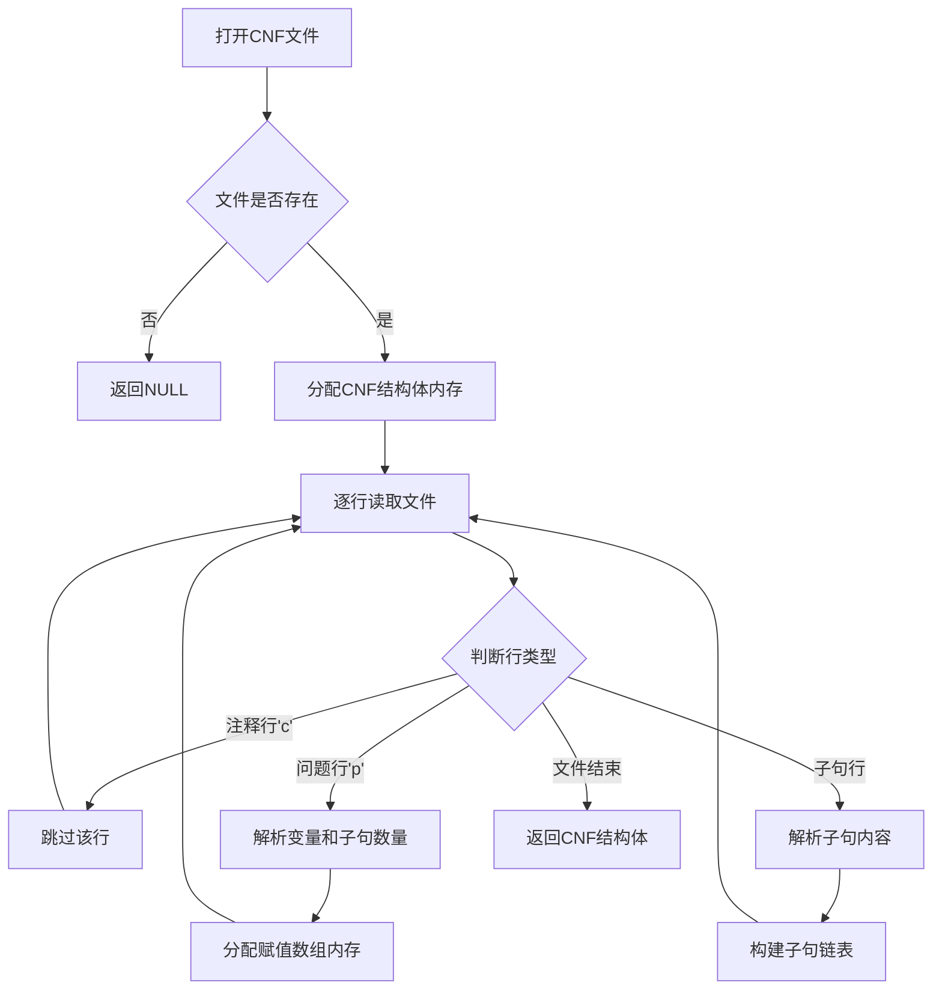

#### 子句解析详细流程
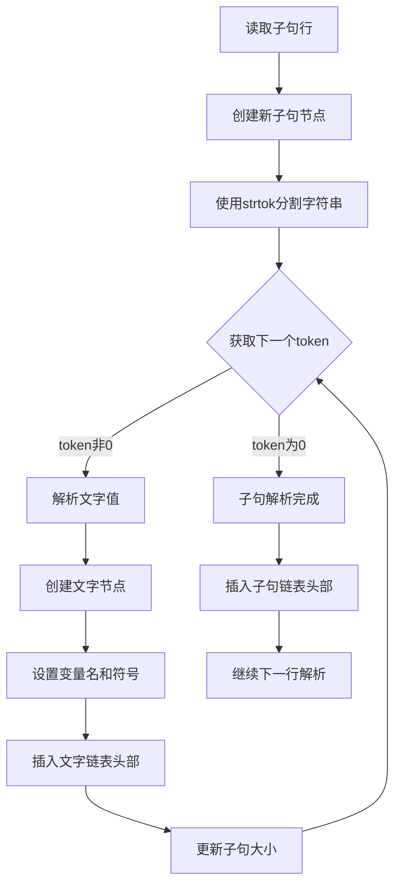

### 2.4 数据结构构建策略

**内存管理机制：**
- 采用链表结构避免预分配大量内存
- 头插法构建链表，提高插入效率
- 统一的内存释放函数防止内存泄漏

**数据验证机制：**
- 检查变量编号范围合法性
- 验证子句格式正确性
- 处理文件读取异常情况

---

## 3. Solver模块实现流程

### 3.1 算法思想
Solver模块实现经典DPLL算法和优化版本，采用递归回溯策略结合单元传播优化，通过启发式变量选择提升求解效率。该模块是整个SAT求解器的核心，实现了Davis-Putnam-Logemann-Loveland算法的完整逻辑。

### 3.2 核心代码实现

#### 单元子句查找函数
```c
int find_unit_clause(cnf *p_cnf)
{
    clause *p_clause = p_cnf->first_clause;
    for (; p_clause != NULL; p_clause = p_clause->next)
    {
        if (evaluate_clause(p_clause, p_cnf->arr) == 1)
            continue;

        int flag = 0;
        int unit_clause = 0;
        literal *p_literal = p_clause->first_literal;

        for (; p_literal != NULL; p_literal = p_literal->next)
        {
            if (p_cnf->arr[p_literal->name] == 0)
            {
                flag++;
                unit_clause = p_literal->name * p_literal->flag;
            }
        }

        if (flag == 0)
            return -1;
        if (flag == 1)
            return unit_clause;
    }
    return 0;
}
```

#### 基础DPLL递归算法
```c
int dpll_recursion(cnf *p_cnf)
{
    int unit;

    while ((unit = find_unit_clause(p_cnf)) != 0)
    {
        if (unit == -1)
            return 0;
        p_cnf->arr[abs(unit)] = unit > 0 ? 1 : -1;
    }

    clause *p_clause = p_cnf->first_clause;
    for (; p_clause != NULL; p_clause = p_clause->next)
    {
        if (evaluate_clause(p_clause, p_cnf->arr) == 0)
        {
            int all_signed = 1;
            literal *p_literal = p_clause->first_literal;
            for (; p_literal != NULL; p_literal = p_literal->next)
            {
                if (p_cnf->arr[p_literal->name] == 0)
                {
                    all_signed = 0;
                    break;
                }
            }
            if (all_signed == 1)
                return 0;
        }
    }

    int var = 0;
    for (int i = 1; i <= p_cnf->num_literal; i++)
    {
        if (p_cnf->arr[i] == 0)
        {
            var = i;
            break;
        }
    }
    if (var == 0)
        return 1;

    int *backup = malloc(sizeof(int) * (p_cnf->num_literal + 1));
    if (backup == NULL)
        return 0;
    memcpy(backup, p_cnf->arr, sizeof(int) * (p_cnf->num_literal + 1));

    p_cnf->arr[var] = 1;
    if (dpll_recursion(p_cnf) == 1)
    {
        free(backup);
        return 1;
    }

    memcpy(p_cnf->arr, backup, sizeof(int) * (p_cnf->num_literal + 1));

    p_cnf->arr[var] = -1;
    int result = dpll_recursion(p_cnf);

    if (result == 0)
        memcpy(p_cnf->arr, backup, sizeof(int) * (p_cnf->num_literal + 1));
    free(backup);
    return result;
}
```

#### 启发式变量选择函数
```c
int choose_variable_heuristic(cnf *p_cnf)
{
    int *freq = calloc(p_cnf->num_literal + 1, sizeof(int));
    if (freq == NULL) return 0;
    
    clause *p_clause = p_cnf->first_clause;
    for (; p_clause != NULL; p_clause = p_clause->next)
    {
        if (evaluate_clause(p_clause, p_cnf->arr) == 1)
            continue;
            
        literal *p_literal = p_clause->first_literal;
        for (; p_literal != NULL; p_literal = p_literal->next)
        {
            if (p_cnf->arr[p_literal->name] == 0)
                freq[p_literal->name]++;
        }
    }
    
    int max_freq = 0, chosen = 0;
    for (int i = 1; i <= p_cnf->num_literal; i++)
    {
        if (p_cnf->arr[i] == 0 && freq[i] > max_freq)
        {
            max_freq = freq[i];
            chosen = i;
        }
    }
    
    free(freq);
    return chosen;
}
```

#### 优化DPLL递归算法
```c
int q_dpll_recursion(cnf *p_cnf)
{
    int unit;
    while ((unit = find_unit_clause(p_cnf)) != 0)
    {
        if (unit == -1) return 0;
        p_cnf->arr[abs(unit)] = unit > 0 ? 1 : -1;
    }

    clause *p_clause = p_cnf->first_clause;
    for (; p_clause != NULL; p_clause = p_clause->next)
    {
        if (evaluate_clause(p_clause, p_cnf->arr) == 0)
        {
            int all_signed = 1;
            literal *p_literal = p_clause->first_literal;
            for (; p_literal != NULL; p_literal = p_literal->next)
            {
                if (p_cnf->arr[p_literal->name] == 0)
                {
                    all_signed = 0;
                    break;
                }
            }
            if (all_signed == 1) return 0;
        }
    }

    int var = choose_variable_heuristic(p_cnf);
    if (var == 0) return 1;

    int *backup = malloc(sizeof(int) * (p_cnf->num_literal + 1));
    if (backup == NULL) return 0;
    memcpy(backup, p_cnf->arr, sizeof(int) * (p_cnf->num_literal + 1));

    p_cnf->arr[var] = 1;
    if (q_dpll_recursion(p_cnf) == 1)
    {
        free(backup);
        return 1;
    }

    memcpy(p_cnf->arr, backup, sizeof(int) * (p_cnf->num_literal + 1));
    p_cnf->arr[var] = -1;
    int result = q_dpll_recursion(p_cnf);

    if (result == 0)
        memcpy(p_cnf->arr, backup, sizeof(int) * (p_cnf->num_literal + 1));
    free(backup);
    return result;
}
```

### 3.3 基础DPLL算法流程

#### DPLL主算法流程
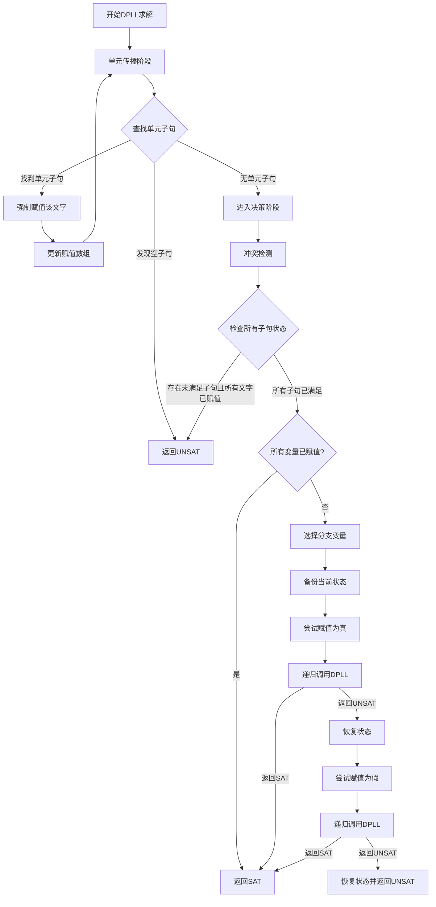

#### 单元传播详细流程
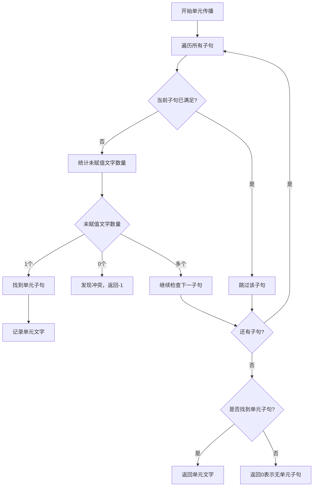

### 3.4 优化DPLL算法流程

#### 启发式变量选择流程
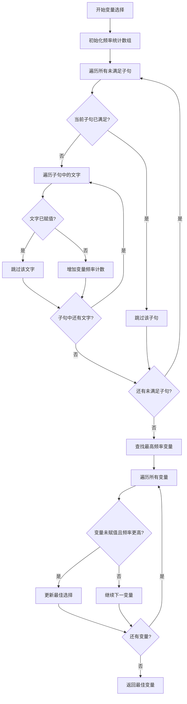

### 3.5 算法优化策略

**单元传播优化：**
- 循环执行直到无新的单元子句
- 立即处理冲突情况
- 减少不必要的搜索分支

**启发式选择策略：**
- 统计变量在未满足子句中的出现频率
- 优先选择"影响最大"的变量
- 理论上能更快满足或排除更多子句

---

## 4. Sudoku模块实现流程

### 4.1 算法思想
Sudoku模块将数独问题转换为SAT问题，利用CNF编码表示数独约束，通过SAT求解器获得数独解答，实现了约束满足问题的经典应用。该模块展示了SAT求解器在实际问题中的应用，将百分号数独的特殊约束转换为布尔可满足性问题。

### 4.2 核心代码实现

#### 百分号数独约束验证
```c
int validate_percent_sudoku_move(int grid[9][9], int row, int col, int num)
{
    // 检查行
    for (int j = 0; j < 9; j++)
    {
        if (j != col && grid[row][j] == num)
        {
            return 0;
        }
    }

    // 检查列
    for (int i = 0; i < 9; i++)
    {
        if (i != row && grid[i][col] == num)
        {
            return 0;
        }
    }

    // 检查3x3盒子
    int box_row = (row / 3) * 3;
    int box_col = (col / 3) * 3;
    for (int i = box_row; i < box_row + 3; i++)
    {
        for (int j = box_col; j < box_col + 3; j++)
        {
            if ((i != row || j != col) && grid[i][j] == num)
            {
                return 0;
            }
        }
    }

    // 检查反对角线约束
    int diag_pos[9][2] = {{0, 8}, {1, 7}, {2, 6}, {3, 5}, {4, 4}, {5, 3}, {6, 2}, {7, 1}, {8, 0}};
    for (int p = 0; p < 9; p++)
    {
        if (diag_pos[p][0] == row && diag_pos[p][1] == col)
        {
            for (int q = 0; q < 9; q++)
            {
                if (q != p && grid[diag_pos[q][0]][diag_pos[q][1]] == num)
                {
                    return 0;
                }
            }
            break;
        }
    }

    // 检查上方窗口约束（位置(1,1)-(3,3)）
    if (row >= 1 && row <= 3 && col >= 1 && col <= 3)
    {
        for (int i = 1; i <= 3; i++)
        {
            for (int j = 1; j <= 3; j++)
            {
                if ((i != row || j != col) && grid[i][j] == num)
                {
                    return 0;
                }
            }
        }
    }

    // 检查下方窗口约束（位置(5,5)-(7,7)）
    if (row >= 5 && row <= 7 && col >= 5 && col <= 7)
    {
        for (int i = 5; i <= 7; i++)
        {
            for (int j = 5; j <= 7; j++)
            {
                if ((i != row || j != col) && grid[i][j] == num)
                {
                    return 0;
                }
            }
        }
    }

    return 1;
}
```

#### 随机化数独生成算法
```c
int solve_percent_sudoku_random(int grid[9][9])
{
    for (int i = 0; i < 9; i++)
    {
        for (int j = 0; j < 9; j++)
        {
            if (grid[i][j] == 0)
            {
                int nums[9] = {1, 2, 3, 4, 5, 6, 7, 8, 9};
                shuffle_array(nums, 9); // 随机打乱数字顺序

                for (int k = 0; k < 9; k++)
                {
                    int num = nums[k];
                    if (validate_percent_sudoku_move(grid, i, j, num))
                    {
                        grid[i][j] = num;
                        if (solve_percent_sudoku_random(grid))
                        {
                            return 1;
                        }
                        grid[i][j] = 0;
                    }
                }
                return 0;
            }
        }
    }
    return 1;
}
```

#### 数独转CNF核心函数（部分）
```c
void sudoku_to_cnf(int grid[9][9], const char *filename)
{
    FILE *file = fopen(filename, "w");
    if (!file)
        return;

    // 计算提示数字数量
    int hints = 0;
    for (int i = 0; i < 9; i++)
    {
        for (int j = 0; j < 9; j++)
        {
            if (grid[i][j] != 0)
                hints++;
        }
    }

    // 计算总子句数量
    int clause_count = 81 + 81 * 36 + 9 * 9 * 2 + 9 * 9 * 36 * 2 + 9 * 9 + 9 * 9 * 36 + 3 * (9 + 9 * 36) + hints;

    fprintf(file, "p cnf 729 %d\n", clause_count);

    // 生成格约束：每格至少一个数字
    for (int i = 1; i <= 9; i++)
    {
        for (int j = 1; j <= 9; j++)
        {
            for (int k = 1; k <= 9; k++)
            {
                fprintf(file, "%d ", (i - 1) * 81 + (j - 1) * 9 + k);
            }
            fprintf(file, "0\n");

            // 每格最多一个数字
            for (int k1 = 1; k1 <= 9; k1++)
            {
                for (int k2 = k1 + 1; k2 <= 9; k2++)
                {
                    fprintf(file, "-%d -%d 0\n",
                            (i - 1) * 81 + (j - 1) * 9 + k1,
                            (i - 1) * 81 + (j - 1) * 9 + k2);
                }
            }
        }
    }

    // 百分号约束：对角线
    int diag_pos[9][2] = {{1, 9}, {2, 8}, {3, 7}, {4, 6}, {5, 5}, {6, 4}, {7, 3}, {8, 2}, {9, 1}};
    for (int k = 1; k <= 9; k++)
    {
        for (int p = 0; p < 9; p++)
        {
            fprintf(file, "%d ", (diag_pos[p][0] - 1) * 81 + (diag_pos[p][1] - 1) * 9 + k);
        }
        fprintf(file, "0\n");
    }

    // 提示数字约束
    for (int i = 0; i < 9; i++)
    {
        for (int j = 0; j < 9; j++)
        {
            if (grid[i][j] != 0)
            {
                fprintf(file, "%d 0\n", i * 81 + j * 9 + grid[i][j]);
            }
        }
    }

    fclose(file);
}
```

### 4.3 数独生成流程

#### 完整数独生成流程
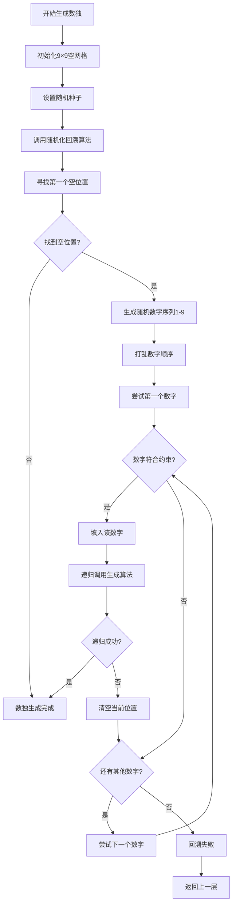

#### 约束验证流程
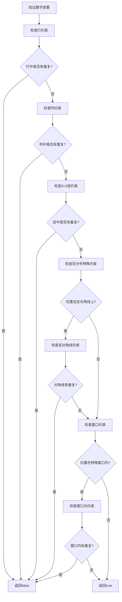

### 4.4 CNF转换流程

#### 数独到CNF编码流程
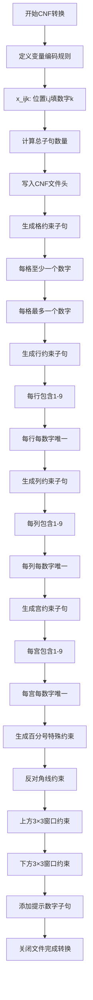

### 4.5 游戏交互流程

#### 数独游戏主流程
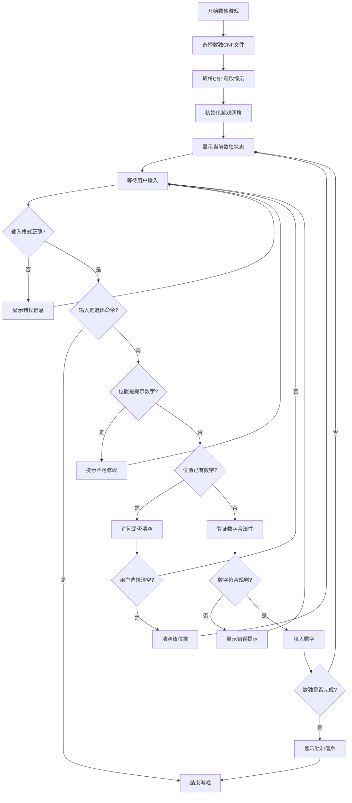

## 系统模块协作流程

### 整体系统交互流程
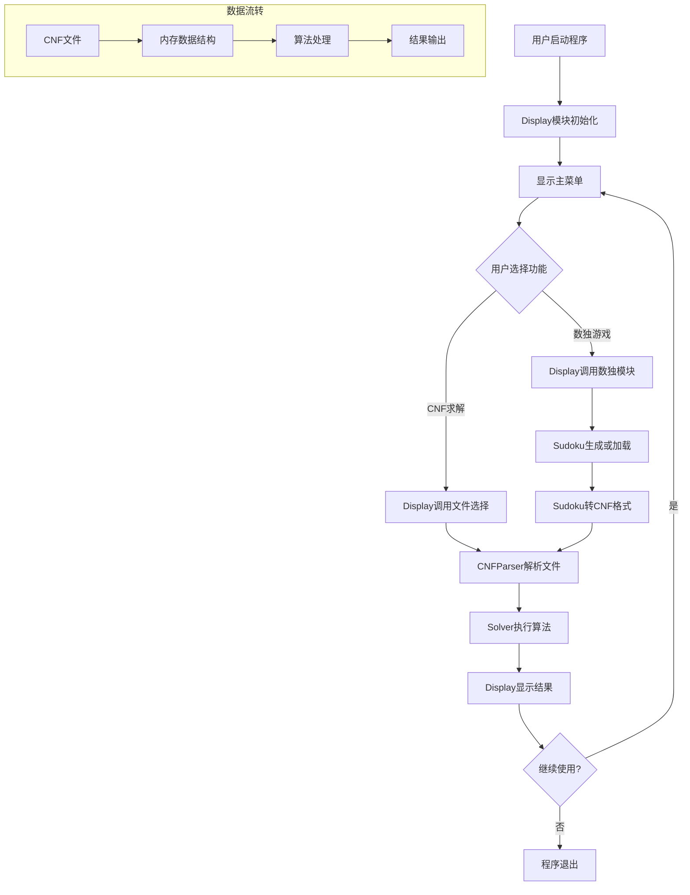

各模块通过标准接口协作，实现了完整的SAT求解系统功能，既能处理通用的CNF文件，也能应用于数独等具体问题领域。

## 5. 系统综合架构图

### 5.1 完整系统模块交互图
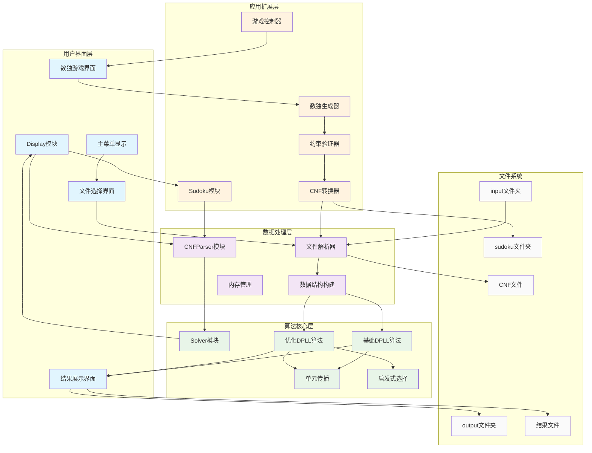

### 5.2 系统数据流向图
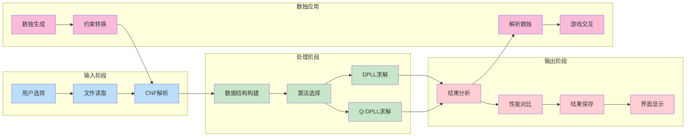

### 5.3 算法执行时序图
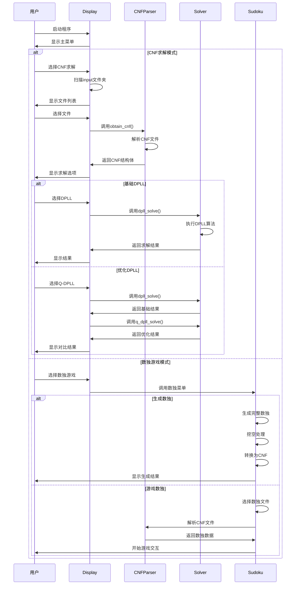

通过以上详细的模块分析和综合架构图，可以清晰地看出整个SAT求解器系统的完整结构。各模块职责明确，接口标准化，既保证了系统的模块化设计，又实现了高效的协作机制。系统不仅能够处理标准的CNF文件求解任务，还能够应用于百分号数独等具体问题领域，展现了SAT求解技术的实用价值。