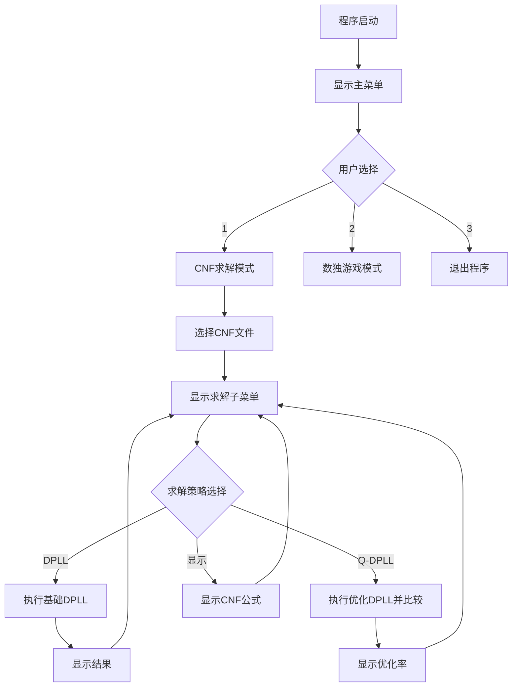
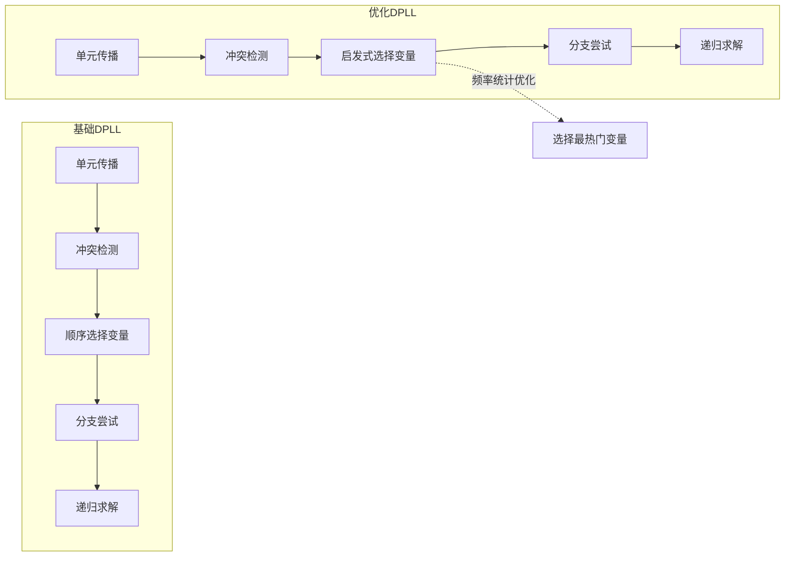
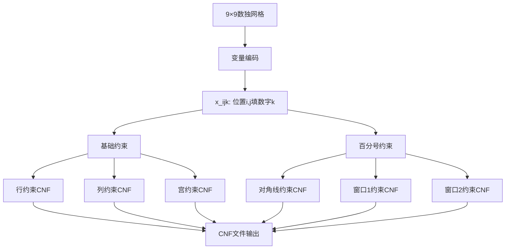
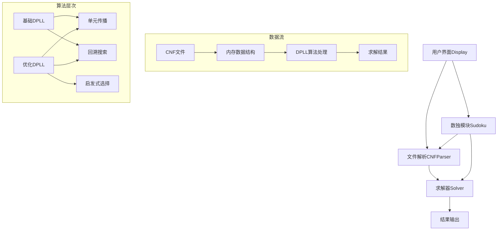

# SAT求解器系统模块详细说明

## 1. Display模块 - 用户界面与交互

### 功能概述
Display模块负责整个程序的用户界面展示和交互逻辑，是用户与SAT求解器系统的桥梁。

### 核心功能

#### 1.1 菜单系统
```c
void print_menu(void)
{
    printf("\n=== Main Menu ===\n");
    printf("1. CNF file solving\n");
    printf("2. Percent Sudoku game\n");
    printf("3. Exit\n");
    printf("Enter your choice: ");
}
```

**作用：** 提供清晰的主菜单界面，让用户选择SAT求解或数独游戏功能。

#### 1.2 CNF求解子菜单
```c
void print_sec_menu(void)
{
    printf("\n=== CNF Solver Menu ===\n");
    printf("1. Use DPLL strategy\n");
    printf("2. Use Q-DPLL strategy and display the optimization rate\n");
    printf("3. Init-display\n");
    printf("4. Back to Main Menu\n");
    printf("Enter your choice: ");
}
```

**作用：** 为CNF求解提供详细选项，包括基础DPLL、优化DPLL和公式显示功能。

#### 1.3 文件选择系统
```c
int select_cnf_file(char *selected_filename)
{
    DIR *dir = opendir("input");
    // 扫描input文件夹中的CNF文件
    // 显示文件列表和大小信息
    // 让用户选择要求解的文件
}
```

**作用：** 自动扫描input文件夹，展示可用的CNF文件列表，方便用户选择。

### 模块流程图



---

## 2. CNFParser模块 - CNF文件解析与数据结构

### 功能概述
CNFParser模块负责解析CNF格式文件，构建内存中的数据结构，为求解器提供标准化的数据接口。

### 数据结构设计

#### 2.1 核心数据结构
```c
// 文字结构体
typedef struct literal {
    int name;             // 变量名
    int flag;             // 符号(1为正，-1为负)
    struct literal *next; // 链表指针
} literal;

// 子句结构体  
typedef struct clause {
    literal *first_literal; // 首文字指针
    int size;               // 子句长度
    struct clause *next;    // 链表指针
} clause;

// CNF范式结构体
typedef struct cnf {
    clause *first_clause; // 首子句指针
    int num_literal;      // 总变量数
    int num_clause;       // 总子句数
    int *arr;             // 变量赋值数组
} cnf;
```

#### 2.2 文件解析函数
```c
cnf *obtain_cnf(const char *filename)
{
    FILE *file = fopen(filename, "r");
    // 逐行读取CNF文件
    // 解析p行获取变量和子句数量
    // 构建链式数据结构
    // 初始化赋值数组
}
```

**解析流程：**
1. 跳过注释行（以'c'开头）
2. 解析问题行（以'p cnf'开头）获取变量数和子句数
3. 逐行解析子句，构建链表结构
4. 为每个文字分配内存并设置正负标志

#### 2.3 子句求值函数
```c
int evaluate_clause(clause *p_clause, int *arr)
{
    // 遍历子句中的所有文字
    // 检查是否有文字使子句为真
    // 返回子句的真值状态
}
```

### 数据结构关系图

```mermaid
graph TD
    A[CNF结构体] --> B[子句链表]
    A --> C[变量赋值数组]
    A --> D[元数据信息]
    
    B --> E[子句1]
    B --> F[子句2]
    B --> G[子句n]
    
    E --> H[文字链表]
    F --> I[文字链表]
    G --> J[文字链表]
    
    H --> K[变量名+符号]
    I --> L[变量名+符号]
    J --> M[变量名+符号]
    
    C --> N[arr[1]=0未赋值]
    C --> O[arr[2]=1为真]
    C --> P[arr[3]=-1为假]
```

---

## 3. Solver模块 - DPLL算法核心实现

### 功能概述
Solver模块是整个SAT求解器的核心，实现了基础DPLL算法和优化的Q-DPLL算法。

### 核心算法实现

#### 3.1 单元传播
```c
int find_unit_clause(cnf *p_cnf)
{
    // 遍历所有子句
    // 查找只有一个未赋值文字的子句
    // 返回单元子句的文字（带符号）
    // 返回-1表示冲突，0表示无单元子句
}
```

**作用：** 实现单元传播优化，自动推导必须的赋值。

#### 3.2 基础DPLL递归
```c
int dpll_recursion(cnf *p_cnf)
{
    // 1. 单元传播循环
    while ((unit = find_unit_clause(p_cnf)) != 0) {
        if (unit == -1) return 0;  // 冲突
        p_cnf->arr[abs(unit)] = unit > 0 ? 1 : -1;
    }
    
    // 2. 冲突检测
    // 3. 完成性检查
    // 4. 变量选择（顺序选择）
    // 5. 分支与回溯
}
```

#### 3.3 优化变量选择策略
```c
int choose_variable_heuristic(cnf *p_cnf)
{
    // 统计每个变量在未满足子句中的频率
    // 选择频率最高的变量
    // 实现"最频繁变量优先"启发式
}
```

### DPLL算法流程对比



---

## 4. Sudoku模块 - 百分号数独应用

### 功能概述
Sudoku模块将SAT求解技术应用到百分号数独游戏中，展示了SAT求解器的实际应用价值。

### 核心功能

#### 4.1 数独生成
```c
int generate_complete_sudoku(int grid[9][9])
{
    // 使用随机化回溯算法生成完整解
    // 确保满足百分号数独的特殊约束
}

void dig_holes(int grid[9][9], int holes)
{
    // 随机挖空指定数量的格子
    // 生成数独谜题
}
```

#### 4.2 CNF转换
```c
void sudoku_to_cnf(int grid[9][9], const char *filename)
{
    // 将数独约束转换为CNF子句
    // 包括：行约束、列约束、宫约束
    // 特殊约束：对角线、窗口约束
}
```

**约束类型：**
1. **基础约束**：每行、每列、每宫包含1-9
2. **百分号约束**：
   - 反对角线约束
   - 上方3×3窗口约束  
   - 下方3×3窗口约束

#### 4.3 游戏交互
```c
void play_percent_sudoku()
{
    // 加载CNF文件解析为数独
    // 提供交互式游戏界面
    // 实时验证用户输入
}
```

### 数独约束转CNF示例



## 系统整体架构



整个系统采用模块化设计，各模块职责清晰，通过标准接口协作，实现了完整的SAT求解功能和数独应用。