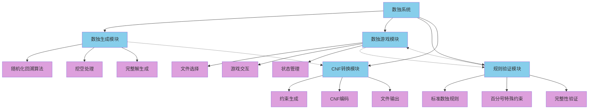
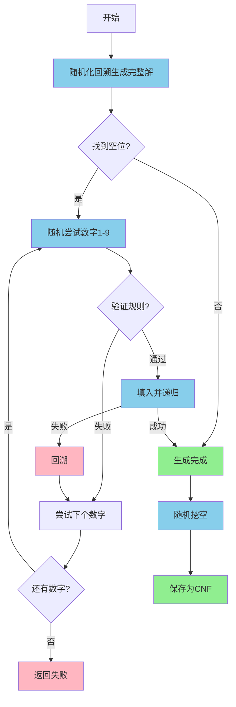
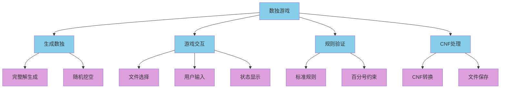
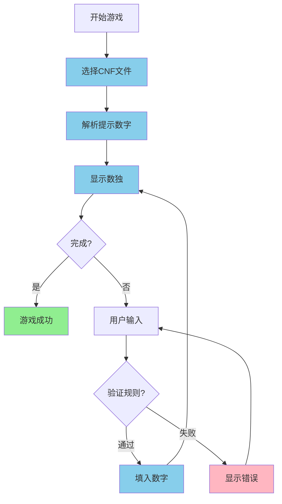
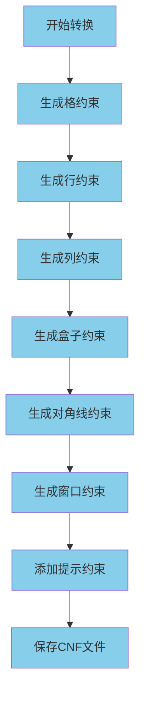

# 数独模块Mermaid流程图

## 数独系统总体架构



## 数独生成流程



## 数独游戏简略大纲



## 数独游戏流程



## 百分号数独规则验证

```mermaid
flowchart TD
    A[验证数字] --> B[检查行]
    B --> C[检查列]
    C --> D[检查3x3盒子]
    D --> E[检查反对角线]
    E --> F[检查窗口(2,2)-(4,4)]
    F --> G[检查窗口(6,6)-(8,8)]
    G --> H[返回结果]
    
    classDef process fill:#87CEEB
    class A,B,C,D,E,F,G,H process
```

## CNF转换流程

